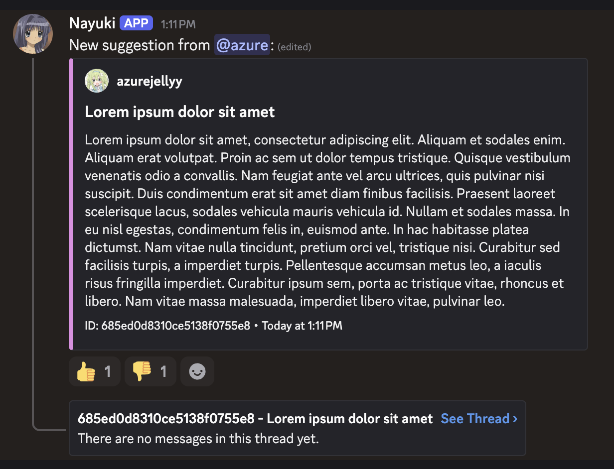

# nayuki

nayuki is an easy to use discord suggestions bot written in go. to get started, simply add it to your server using [this link](https://discord.com/oauth2/authorize?client_id=1381268909226987630&permissions=395137000512&integration_type=0&scope=bot+applications.commands).

<p align="center">
    
</p>

## project setup

to get started, you'll need:

- an internet connection
- a mongodb instance
- go >= 1.24.4
- git

first, clone the repository:

```shell
$ git clone https://github.com/azurejelly/nayuki
$ cd nayuki/
```

then, copy the `.env.example` file into `.env` and modify it accordingly:

```shell
$ cp .env.example .env
$ code .env # or just use your preferred editor (e.g. nano, vim)
```

to get a temporary development mongodb instance using docker, run:

```shell
$ docker run -d --rm \
    --name "mongo" \
    -p 127.0.0.1:27017:27017 \
    mongo:latest
```

the default value for `MONGO_URI` in the `.env.example` file should work out of the box with this docker container.
if you no longer need the mongodb server, simply run the following command to remove it:

```shell
$ docker stop mongo
```

finally, you can run the bot using:

```shell
$ go run main.go
```

or compile it with:

```shell
$ go build main.go -o nayuki
$ ./nayuki
```

## with docker

clone the repository:

```shell
$ git clone https://github.com/azurejelly/nayuki
$ cd nayuki/
```

copy `.env.example` to `.env` and modify `TOKEN` and `GUILD_ID` (if needed):

```shell
$ cp .env.example .env
$ code .env # or just use your preferred code editor (e.g. nano, vim)
```

and finally, start the stack:

```shell
$ docker compose up -d
```

the existing [docker compose configuration](./docker-compose.yml) will automatically spin up a mongodb server for the bot to use. you'll need to edit it if you want to use an existing database.
